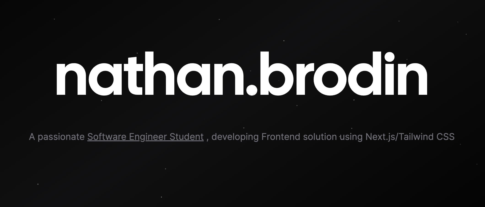

# Hi there 👋

Welcome to my Github Profile!

**Check out my [AI Chatbot Portfolio](https://chat.brodin.dev) for more information about me and my work.**

## Github Stats  

  
  

  

   

It seems I'm quite popular, thanks for visiting my profile!

